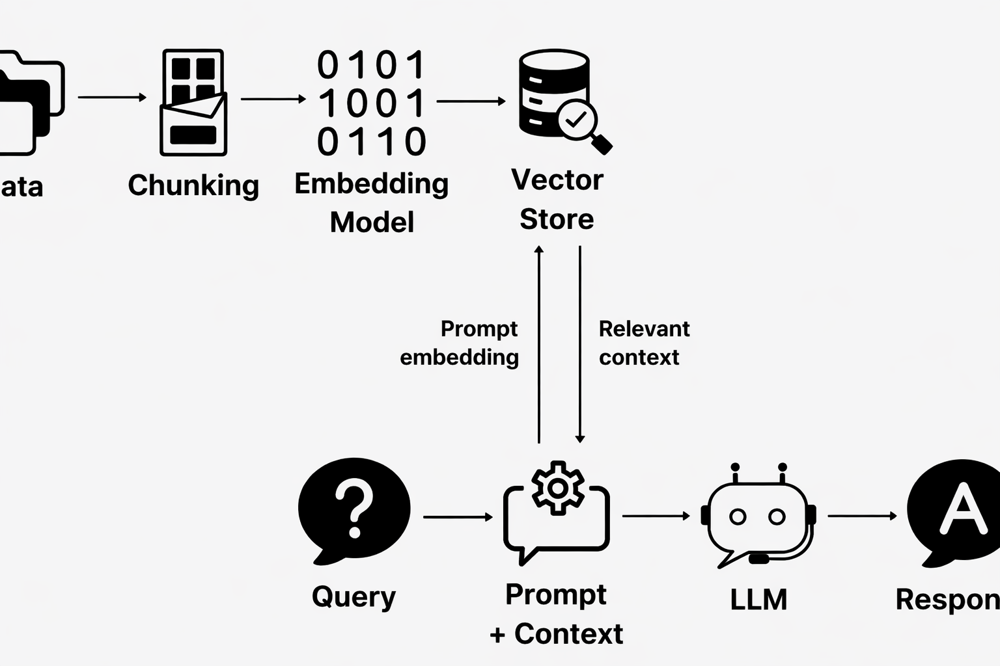

# 🧠 Bedrock Knowledge Assistant

A conversational AI application built using **AWS Bedrock Knowledge Bases (RAG)** and **Gemini**, designed to retrieve and generate context-aware answers from enterprise data.

---

## 🚀 Overview

This project implements a **Retrieval-Augmented Generation (RAG)** pipeline that enables users to interact with a knowledge base through natural language.

It retrieves relevant information from an AWS Bedrock Knowledge Base (backed by S3) and generates responses using a Large Language Model, while maintaining conversational context for follow-up queries.

---

## 🧑‍💻 Internship Context

Developed as part of a **Generative AI Internship**, this project focuses on building a practical, production-oriented GenAI system by integrating cloud services, retrieval systems, and LLMs into a single application.

---

## ✨ Features

- Context-aware retrieval using AWS Bedrock Knowledge Base  
- Conversational memory for multi-turn interactions  
- Intelligent handling of greetings and simple queries  
- Retry and fallback mechanisms for LLM reliability  
- Clean and interactive UI built with Streamlit  

---

## 🏗️ Architecture

---

## 🧰 Tech Stack

- **AWS Bedrock** – Knowledge Base, Vector Retrieval  
- **Amazon S3** – Data source  
- **Python (boto3)** – Backend integration  
- **Streamlit** – User interface  
- **Gemini API** – Response generation  

---

## 🌐 Live Demo
https://enterpriseknowledgeassistant-zu4sthrezt6pmrmpgygp9p.streamlit.app/

## ⚙️ Setup Instructions

### 1. Clone the repository
bash
git clone <your-repo-link>
cd <project-folder>

### 2. Vitual environment
python -m venv venv
venv\Scripts\activate

### 3.Installing Dependencies
pip install -r requirements.txt

### 4. Configure environment variables
AWS_REGION=ap-southeast-2
gemini_key=YOUR_GEMINI_API_KEY

### 5. Configure AWS credentials
aws configure

### 6.Run the application
Run the application

📌 Notes
Ensure your AWS IAM user has:
AmazonBedrockFullAccess
AmazonS3FullAccess
Upload your documents (PDFs) to S3 before querying
Bedrock Knowledge Base must be created and synced

